# Assignment 3

# A. Neural Volume Rendering

## 1. Differentiable Volume Rendering

### 1.3 Ray sampling

**Rays Visualization:**

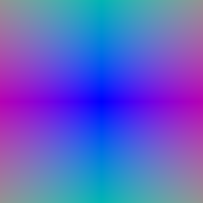

**Grid Visualization:**

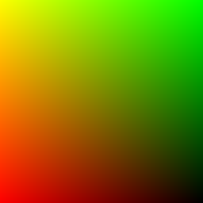

### 1.4 Point sampling

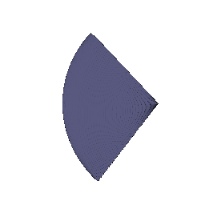

### 1.5 Volume rendering

**Depth:**

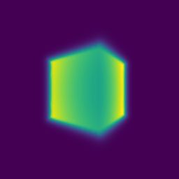

**Gif:**

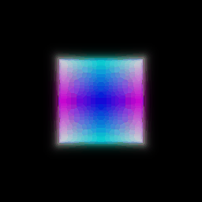

## 2. Optimizing a basic implicit volume

**Visualization:**

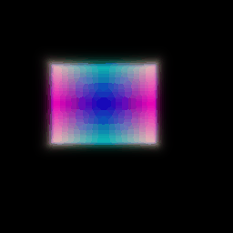

## 3. Optimizing a Neural Radiance Field

**Visualization:**

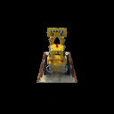

## 4. NeRF Extras

# B. Neural Surface Rendering

## 5. Sphere Tracing

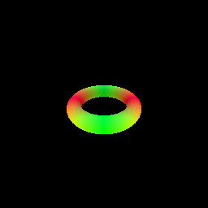

The implementation iteratively updates a set of points by applying an implicit function to compute a step size, then updating the points by moving them in given directions, and finally checking whether all steps are below a small threshold (1e-6) to decide when to stop, returning the final points and a convergence mask.

## 6. Optimizing a Neural SDF

**Input:**

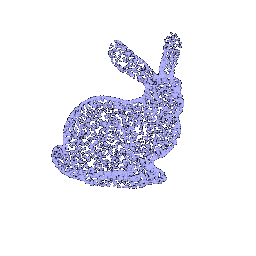

**Output:**

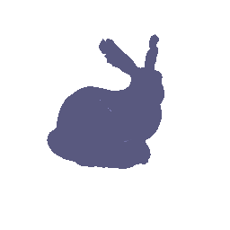

## 7. VolSDF

Setting: alpha: 10.0 beta: 0.01

Compared to init beta: 0.05, with beta 0.01, the final model has more details and is sharper.

**Visualizatoin:**

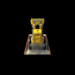

**Geometry:**

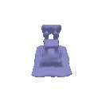

1. How does high `beta` bias your learned SDF? What about low `beta`?

   Hight beta smooths the density transition around the surface, making the density decay more gradually with distance. This biases the SDF to prioritize broader, coarser geometric structures, as the loss gradients are less sensitive to small SDF errors.

   Low beta sharpens the density transition, forcing the density to concentrate sharply near the SDF’s zero-level set. This biases the SDF to focus on fine geometric details, but may amplify high-frequency noise if the SDF is under-optimized.

2. Would an SDF be easier to train with volume rendering and low `beta` or high `beta`? Why?

   Training is easier with **high beta**. A larger beta produces smoother density gradients, which stabilize optimization by preventing abrupt gradient changes. This allows the model to first learn a coarse geometry before refining details. Low beta introduces steep gradients that can cause instability, especially early in training when the SDF is poorly initialized.

3. Would you be more likely to learn an accurate surface with high `beta` or low `beta`? Why?

   Low beta. A small beta enforces a sharp density peak near the SDF’s zero-crossing, which tightly couples the density field to the true surface geometry. High beta produces a "blurred" density that tolerates SDF inaccuracies, leading to smoother but less precise surfaces. 

## 8. Neural Surface Extras

### 8.2 Fewer Training Views 

**100 training views (reference):**

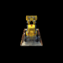

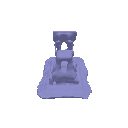

**NeRF:**

**50 views:**

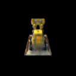

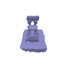

**NeRF:**

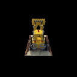

**20 views:**

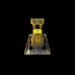

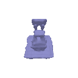

**NeRF:**

**10 views:**

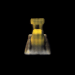

**NeRF:**

**5 views:**

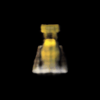

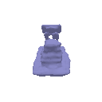

**NeRF:**

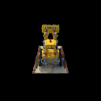

**1 view:**

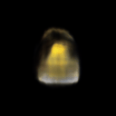

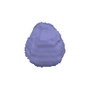

**NeRF:**

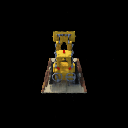

****

